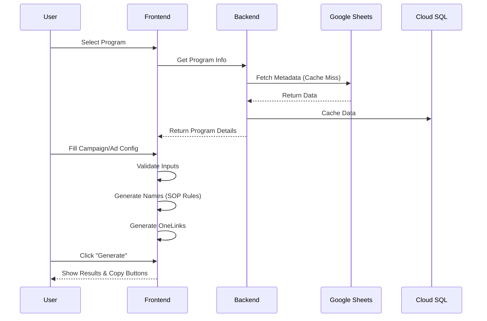
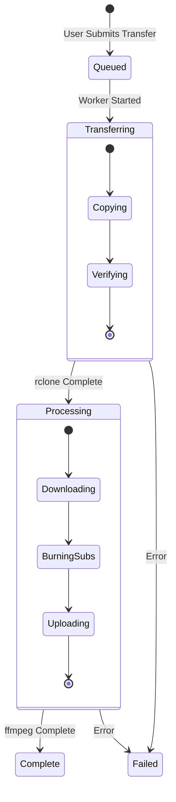

# AutoGrowth Project Documentation (AI Context)

## 1. Project Structure Overview

```text
AutoGrowth/
├── backend/                 # FastAPI Backend (Python 3.11)
│   ├── app/
│   │   ├── api/             # API Routers (v1)
│   │   ├── core/            # Config, Security, Logging
│   │   ├── models/          # SQLAlchemy Models
│   │   ├── schemas/         # Pydantic Schemas
│   │   ├── services/        # Business Logic (Naming, Pipeline, etc.)
│   │   ├── workers/         # Cloud Run Jobs (Transfer, Process)
│   │   └── main.py          # App Entrypoint
│   ├── alembic/             # Database Migrations
│   ├── requirements.txt     # Python Dependencies
│   └── Dockerfile           # Backend Container Config
├── frontend/                # Next.js Frontend (TypeScript)
│   ├── src/
│   │   ├── app/             # App Router Pages
│   │   ├── components/      # UI Components (AntD + Tailwind)
│   │   ├── features/        # Feature-specific Logic
│   │   ├── lib/             # Utilities (API Client, Firebase)
│   │   ├── types/           # TypeScript Definitions
│   └── package.json         # Node Dependencies
├── .spec-workflow/          # Project Specifications
│   └── specs/
│       ├── campaign-naming-generator/
│       └── short-drama-resource-pipeline/
└── infra/                   # Infrastructure as Code (Terraform/Scripts)
```

## 2. Core Architecture & Data Flow

### System Context Diagram

```mermaid
graph TD
    User((User/Operator))
    
    subgraph Frontend [Next.js Frontend :3001]
        UI_Naming[Naming Tool UI]
        UI_Pipeline[Resource Pipeline UI]
        Auth_Client[Firebase Auth Client]
    end
    
    subgraph Backend [FastAPI Backend :8000]
        API_Gateway[API Router]
        Service_Naming[Naming Service]
        Service_Pipeline[Pipeline Service]
        Service_Auth[Auth Service]
    end
    
    subgraph Cloud_Services [Google Cloud Platform]
        CloudSQL[(Cloud SQL PG)]
        Firestore[(Firestore)]
        GCS[Cloud Storage]
        CloudRun_Jobs[Cloud Run Jobs]
        SecretMgr[Secret Manager]
    end
    
    subgraph External [External Services]
        GSheets[Google Sheets]
        GDrive[Google Drive]
        Firebase_Auth[Firebase Auth]
    end

    User --> UI_Naming
    User --> UI_Pipeline
    
    UI_Naming --> Auth_Client
    UI_Pipeline --> Auth_Client
    Auth_Client --> Firebase_Auth
    
    UI_Naming --> API_Gateway
    UI_Pipeline --> API_Gateway
    
    API_Gateway --> Service_Auth
    Service_Auth --> Firebase_Auth
    
    API_Gateway --> Service_Naming
    Service_Naming --> GSheets : Read Program Info
    Service_Naming --> CloudSQL : Store History/Cache
    
    API_Gateway --> Service_Pipeline
    Service_Pipeline --> GDrive : Browse Files
    Service_Pipeline --> Firestore : Create Jobs
    Service_Pipeline --> CloudRun_Jobs : Trigger Workers
    
    CloudRun_Jobs --> GDrive : rclone Copy
    CloudRun_Jobs --> GCS : Store/Process Media
    CloudRun_Jobs --> Firestore : Update Status
```

### Module: Campaign Naming Generator



### Module: Short Drama Resource Pipeline


